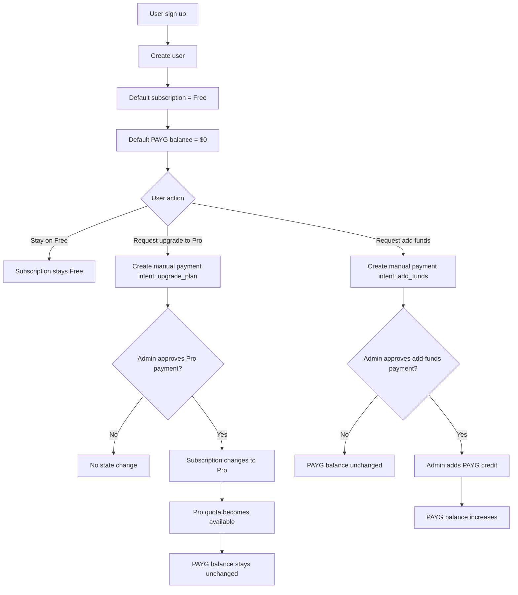
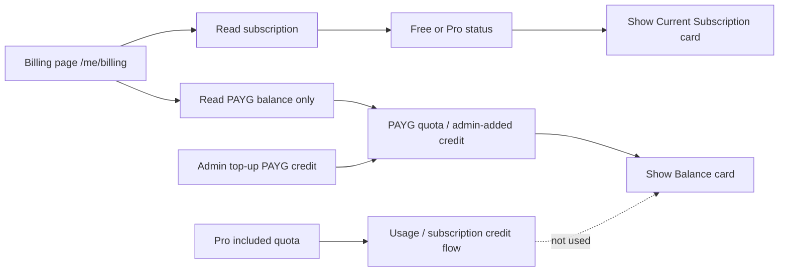
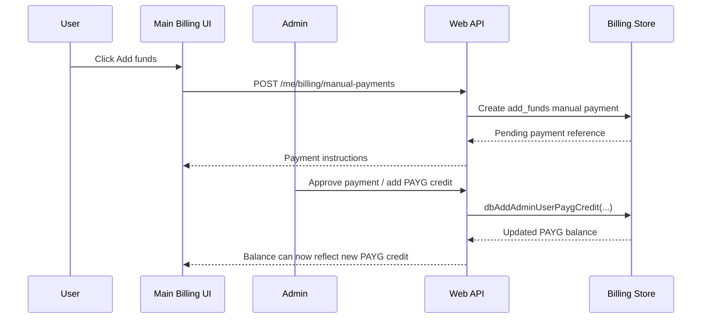
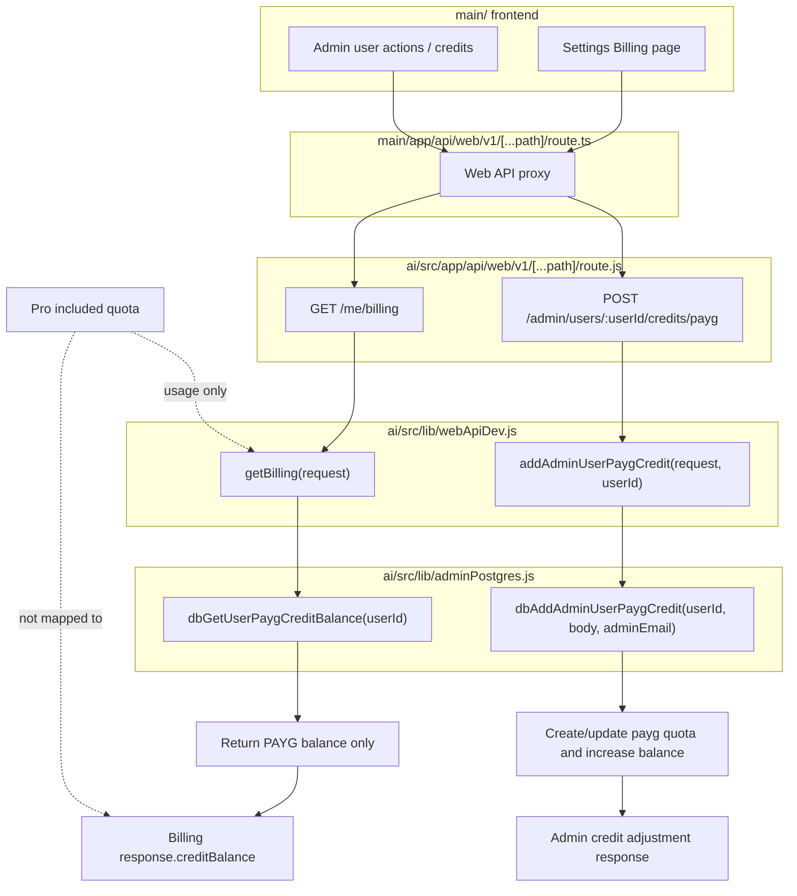

# Dwipa Billing Flow

Dokumen ini merangkum aturan billing yang sekarang berlaku di repo ini:

- User baru default ke `Free`
- PAYG balance default ke `$0`
- Upgrade subscription ke `Pro` tidak menambah PAYG balance
- PAYG balance hanya bertambah saat admin menambahkan credit PAYG

## User And Billing State

## Balance Source Of Truth

## Admin-Controlled PAYG Credit Path

## Technical Endpoint To Function Mapping

